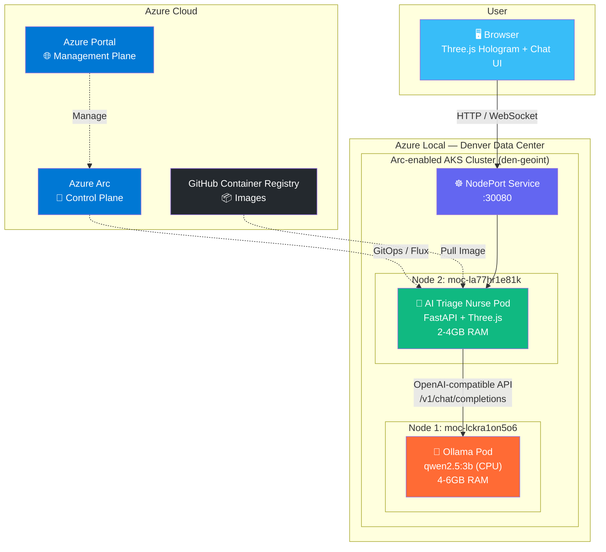
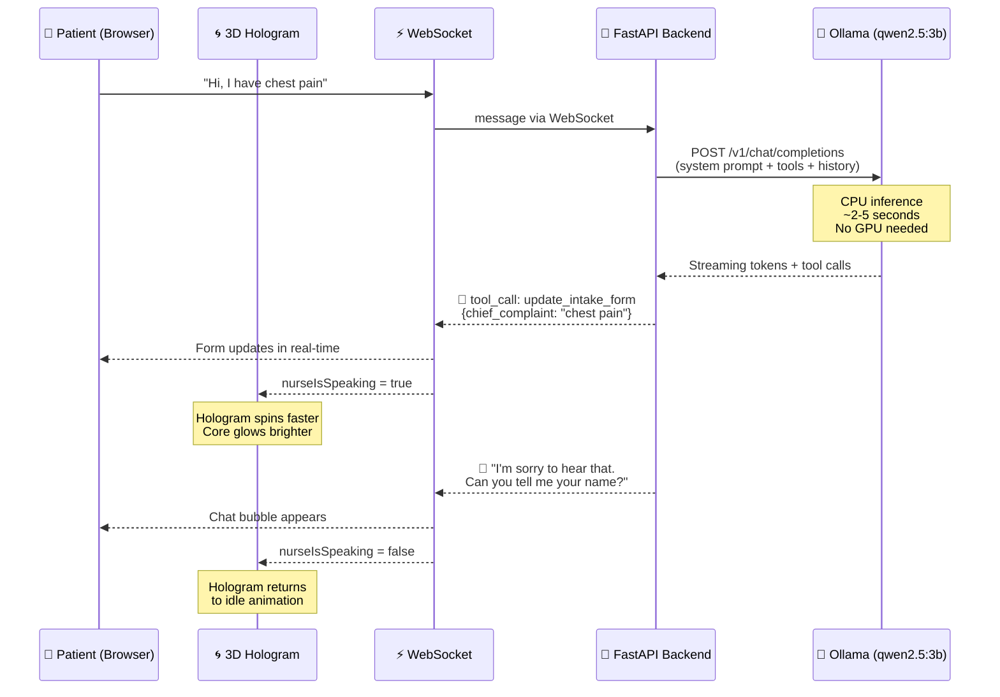
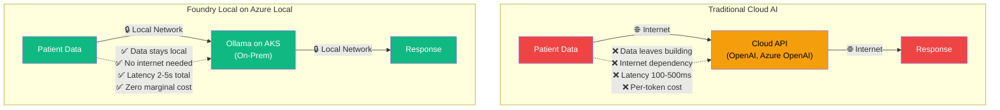
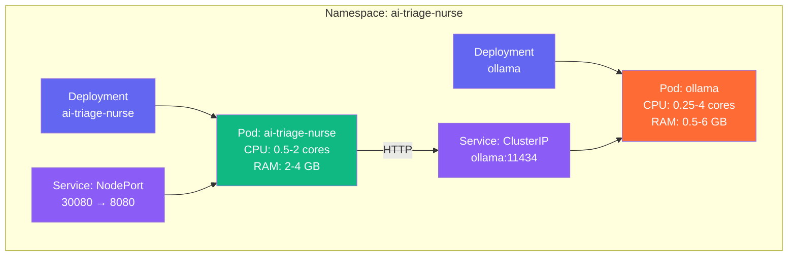

# Architecture Diagrams — AI Triage Nurse on Azure Local

## High-Level Architecture

## Data Flow — Patient Conversation

## Component Stack

```mermaid
graph LR
    subgraph "Frontend (Browser)"
        UI["Chat UI<br/>HTML/CSS/JS"]
        TJS["Three.js r128<br/>3D Hologram"]
        WS1["WebSocket Client"]
    end

    subgraph "Backend Pod"
        FA["FastAPI<br/>Python 3.11"]
        TE["Triage Engine<br/>Tool Call Parser"]
        FM["Foundry Manager<br/>AsyncOpenAI Client"]
    end

    subgraph "Inference Pod"
        OL["Ollama Server"]
        QW["qwen2.5:3b<br/>3B params, CPU"]
    end

    UI --> WS1
    TJS --> UI
    WS1 -->|"WebSocket"| FA
    FA --> TE
    TE --> FM
    FM -->|"OpenAI API"| OL
    OL --> QW

    style UI fill:#38bdf8,color:#000
    style TJS fill:#22d3ee,color:#000
    style FA fill:#10b981,color:#fff
    style TE fill:#059669,color:#fff
    style FM fill:#047857,color:#fff
    style OL fill:#ff6b35,color:#fff
    style QW fill:#ea580c,color:#fff
```

## Edge vs Cloud — Why This Matters

## Kubernetes Resource Layout

